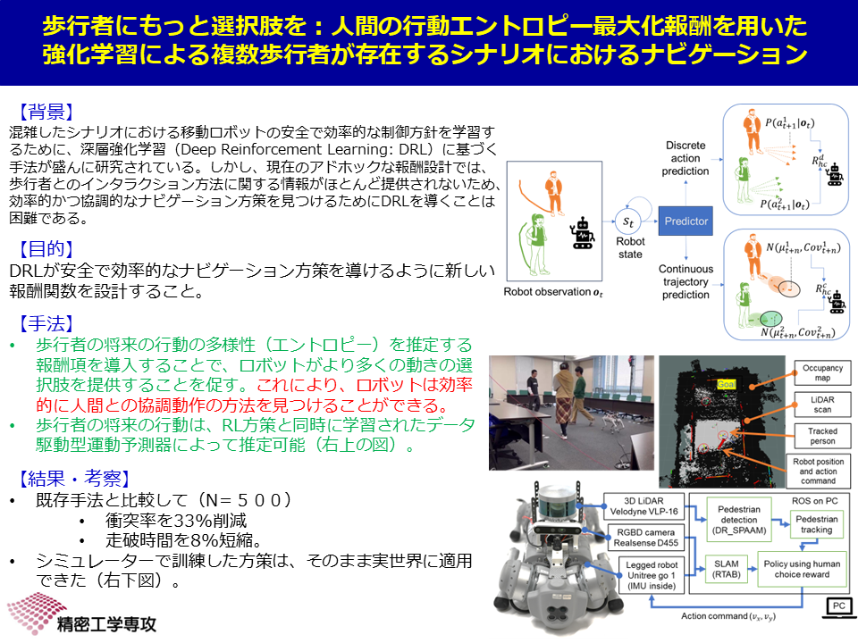

# Semantic Sensor Fusion for Unitree Go1

Welcome to the repository for the Semantic Sensor Fusion for Unitree Go1 project, developed by the Real World Robot Informatics Lab at the University of Tokyo. 

This project aims to enhance the robot's ability to associate its surroundings with objects, thereby imbuing them with meaning, and subsequently applying SLAM (Simultaneous Localization and Mapping) techniques.

This work is part of the research conducted by PhD student Jiaxu Wu.



## Code

The robot operates using ROS1 Noetic. To facilitate its use on any computer, we have created a Docker environment. This repository contains scripts for installing and running the Docker environment for both simulation and development purposes.

The Docker image is based on the OSRF ROS-Desktop-Full Noetic environment, which utilizes an Ubuntu 20 image.

The installation process is compatible with any version of Ubuntu and requires 3.6GB of disk space for the Docker image. Note that Windows and macOS are not supported.

## Docker

### Installation Steps

1. Navigate to the directory containing the ROS1 Docker scripts:

    ```bash
    cd go/to/the/directory/ros1_docker
    ```

2. Ensure the bash scripts are executable (this may be necessary after downloading):

    ```bash
    chmod +x ./bash_scripts/*.bash
    ```

3. If Docker is not already installed on your system, follow the steps in the [Docker installation documentation](https://docs.docker.com/get-docker/), or run the pre-made installation script from within the same directory:

    ```bash
    ./bash_scripts/install_docker.bash
    ```

### Using the Docker Container

Once Docker is installed, you can run the script to install the ROS1 Docker environment. This will download the preconfigured Docker image and the necessary sources for ros1:

```bash
./bash_scripts/install_ros1_docker.bash
```

The ros1 sources are placed in `./home/catkin_ws/src`. This workspace is where you will add your own ROS packages. The `./home` directory is shared between your host OS and the Docker container, meaning any changes made on one side will be reflected on the other.

⚠️ **IMPORTANT** ⚠️

The Docker container is deleted once you close it. Any files outside of the shared directory will be lost.

### First Launch

To run the container, execute the following script:

```bash
./bash_scripts/start_docker.bash
```

Your shell will switch to the Docker container, and you should be placed in the `/home` directory, which is shared with your host.

You should see the `catkin_ws` directory containing the ros1 files:

```bash
ll
# drwxr-xr-x 1 root root 4096 Nov  9 16:40 ./
# drwxr-xr-x 1 root root 4096 Nov  9 16:41 ../
# drwxr-xr-x 3 root root 4096 Nov  9 16:40 catkin_ws/
```

Navigate to the workspace, build it, and source it:

```bash
cd catkin_ws/
catkin_make
source devel/setup.bash
```

To exit the container, just type :

```bash
exit
```

